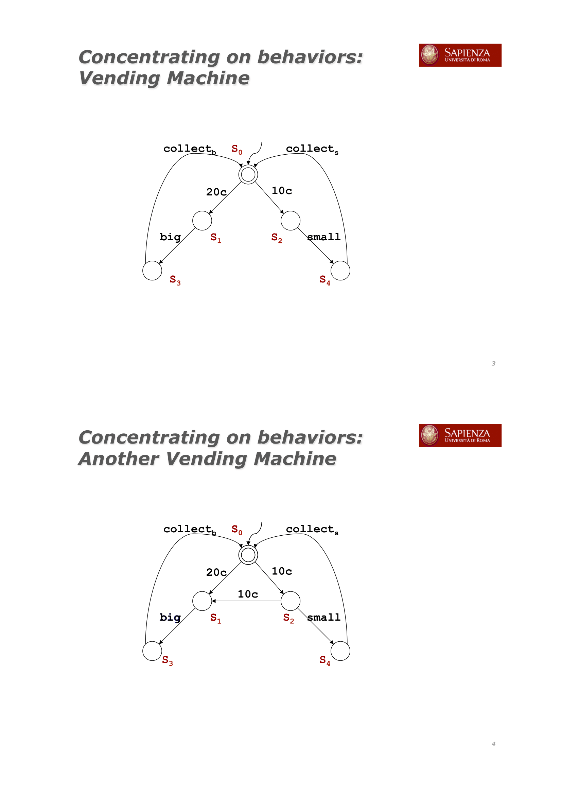
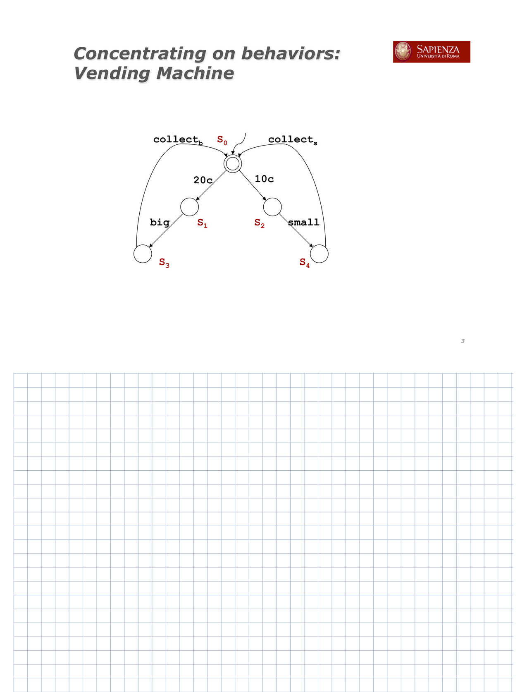
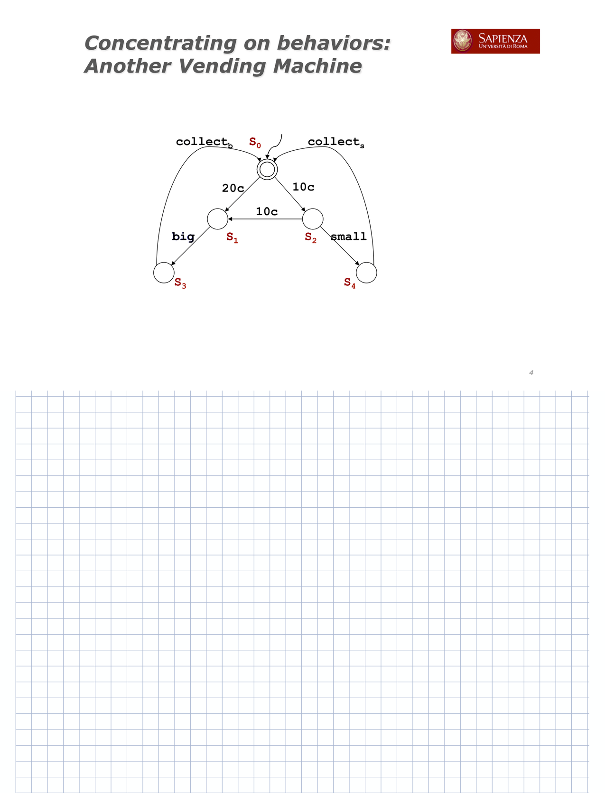

# Slides_to_Notability

If you can't take notes on slides that are too small to write on them or if you have too long slides, this program is for you.

	 
	 
	 

## Usage

- First of all, if you start from a PDF file, you have to extract all the pages contained in it. To do this you will need to:
	-	Upload the file to https://pdf2png.com e
	- 	Download the zip file and extract it inside the "input" folder
- Run the python file and collect the new PDF in "output" folder 